**Previous:** [Series index](/)  
**Next:** [Part 2 — Terraform + AWS](/posts/part-2-terraform-aws-three-tier/)

---

## Who this is for

You might be thinking: *“I don’t know AWS yet.”* This article is the **first step** in the series. We build the **same architecture** you will later automate with Terraform in [Part 2](/posts/part-2-terraform-aws-three-tier/), but here you create every resource **manually** in the **AWS Management Console** so you see **what** each service is and **how** pieces connect.

No Terraform required for this post. You only need an AWS account and patience (first-time setup takes about **45–90 minutes**, mostly waiting on RDS and EC2 bootstrap).

---

## What we are building

A **three-tier** Todo application:

| Tier | Role | In this project |
|------|------|-----------------|
| **Presentation** | User interface | React (Vite) on EC2 in a **public** subnet (nginx on port 80) |
| **Application** | Business logic / API | Node.js + Express on EC2 in a **private** subnet (port 5000) |
| **Data** | Persistent storage | Amazon RDS for MySQL in **private** subnets (two AZs) |

Traffic flow:

```text
Browser → Frontend EC2 (nginx :80) → /api proxied to → Backend EC2 (:5000) → RDS (:3306)
```

Private instances reach the internet (git, npm) via a **NAT Gateway** in the public subnet.

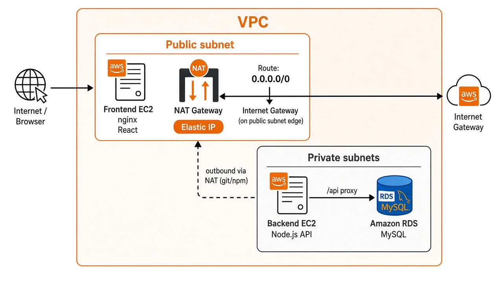

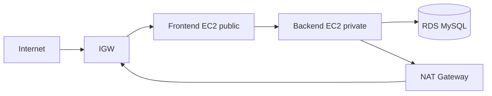

---

## Before you start — pick consistent names

Use one **project prefix** everywhere so resources are easy to find. This guide uses **`my-project`** (same default as the companion repo). Replace it if you prefer another name.

| Setting | Value used in this guide |
|---------|---------------------------|
| **Region** | `us-east-1` (N. Virginia) — change only if you accept different AZ names |
| **VPC CIDR** | `10.0.0.0/16` |
| **Public subnet** | `10.0.1.0/24` (first AZ) |
| **Private subnet A** | `10.0.2.0/24` (first AZ) |
| **Private subnet B** | `10.0.3.0/24` (second AZ) |
| **DB name** | `todo_app` |
| **DB master user** | `dbadmin` |
| **DB password** | Choose a strong password and save it securely |
| **GitHub repo (public)** | `https://github.com/mahisat/aws-basic-3-tier-architecture` |

**Tip:** Open a text file and paste IDs as you create resources (VPC ID, subnet IDs, security group IDs, RDS endpoint, backend private IP). You will need them later.

### Keep every copy of a value the same

In the Console track you replace Terraform placeholders by hand. One password, endpoint, or IP often appears in **several** places in your scripts. Update **all** of them, or you will see errors that look unrelated (**504** or **502** from nginx when the backend IP is wrong, RDS login failures, browser timeouts).

| Value | Where it must match |
|-------|---------------------|
| **RDS endpoint, user, password, database name** | RDS create form **and** every occurrence in **backend** `backend-setup.sh` (including `.env` the script writes) |
| **Backend private IP** | EC2 console (backend instance) **and** every occurrence in the embedded nginx config inside **frontend** `frontend-setup.sh` (`${backend_host}` and inside `${nginx_conf}`) |
| **GitHub repo URL** | Both bootstrap scripts if you use a fork |

**Before launch:** search each edited script for leftover `${` — none should remain. Search for the **old** IP or password after a change so you do not miss a second copy.

**After launch:** user data runs at **first boot** only. Stopping and starting an instance does **not** replay user data by default, and it does **not** change private IPs on the same instance. If you **terminate and recreate** the backend, AWS assigns a **new** private IP; the frontend nginx still points at the old IP until you fix `/etc/nginx/` (and reload) or re-run frontend bootstrap with the new IP. Editing user data in the console without re-running cloud-init does not update files already on the disk.

Take extra care when you change any variable mid-lab: confirm the live value in the AWS console, then confirm every script and config on the instances matches it.

---

## Phase 1 — Networking (VPC)

### 1. Create the VPC

1. Sign in to the [AWS Management Console](https://console.aws.amazon.com/).
2. Set the region to **US East (N. Virginia) / us-east-1** (top-right).
3. Open **VPC** → **Your VPCs** → **Create VPC**.
4. Choose **VPC only** (not “VPC and more” — we want to understand each step).
5. **Name tag:** `my-project-vpc`
6. **IPv4 CIDR:** `10.0.0.0/16`
7. **Tenancy:** Default
8. Enable **DNS hostnames** and **DNS resolution** if shown (or enable later under VPC actions → *Edit VPC settings*).
9. **Create VPC**.

### 2. Create subnets (one public, two private)

Open **VPC** → **Subnets** → **Create subnet**.

**Public subnet**

- **VPC:** `my-project-vpc`
- **Subnet name:** `my-project-public-subnet`
- **Availability Zone:** pick the **first** AZ in the list (e.g. `us-east-1a`)
- **IPv4 CIDR:** `10.0.1.0/24`
- **Create**

**Private subnet A**

- **Name:** `my-project-private-subnet-a`
- **AZ:** same as public (e.g. `us-east-1a`)
- **CIDR:** `10.0.2.0/24`

**Private subnet B** (required for RDS)

- **Name:** `my-project-private-subnet-b`
- **AZ:** a **different** AZ (e.g. `us-east-1b`)
- **CIDR:** `10.0.3.0/24`

**Enable public IPs on the public subnet**

1. Select `my-project-public-subnet` → **Actions** → **Edit subnet settings**.
2. Enable **Auto-assign public IPv4 address** → **Save**.

### 3. Internet Gateway (IGW)

1. **VPC** → **Internet gateways** → **Create internet gateway**.
2. **Name:** `my-project-internet-gateway` → **Create**.
3. Select it → **Actions** → **Attach to VPC** → choose `my-project-vpc`.

### 4. NAT Gateway (for private outbound internet)

The console UI changed: you will see a **Name** field and **Availability mode** before subnet options appear.

1. **VPC** → **NAT gateways** → **Create NAT gateway**.
2. **Name - optional:** `my-project-nat-gateway` (makes it easy to pick in route tables).
3. **Availability mode:** choose **Zonal** (not **Regional - new**).
   - **Why:** **Regional** NAT is managed across AZs and the wizard often **hides the subnet dropdown**. This lab matches [Part 2 Terraform](/posts/part-2-terraform-aws-three-tier/): one **public** NAT in `my-project-public-subnet`.
4. **VPC:** `my-project-vpc` (`vpc-…`).
5. **Subnet:** `my-project-public-subnet` (only shown in **Zonal** mode — NAT must live in a **public** subnet).
6. **Connectivity type:** **Public**.
7. **Elastic IP allocation:**
   - If you see **Manual:** choose **Allocate Elastic IP** (create new).
   - If you only see **Automatic:** leave **Automatic** (AWS assigns EIPs for you).
8. **Create NAT gateway** → wait until status is **Available** (a few minutes).

**Note:** NAT Gateway has an hourly cost; see [Cost](#cost-considerations).

**If you already created a Regional NAT:** you can keep it for this lab — in the **private** route table, set `0.0.0.0/0` → that NAT. For the closest match to the Terraform repo, delete it and recreate with **Zonal** + `my-project-public-subnet`.

### 5. Route tables

**Public route table**

1. **VPC** → **Route tables** → **Create route table**.
2. **Name:** `my-project-public-route-table`, **VPC:** `my-project-vpc` -> Create Route Table.
3. Open it → **Routes** → **Edit routes** → **Add route**:
   - Destination: `0.0.0.0/0`
   - Target: Internet Gateway → `my-project-internet-gateway` → Save Changes
4. **Subnet associations** → **Edit subnet associations** → select **only** `my-project-public-subnet` → Save Associations.

**Private route table**

1. Create another route table: `my-project-private-route-table` → Create Route Table.
2. **Add route:** `0.0.0.0/0` → **NAT Gateway** → your NAT(my-project-nat-gateway) → Save.
3. **Associate** both `my-project-private-subnet-a` and `my-project-private-subnet-b`.

**Beginner check:** Public subnet → IGW. Private subnets → NAT only (no direct IGW).

---

## Phase 2 — Security groups (firewalls)

Open **EC2** → **Security Groups** → **Create security group** (repeat four times). Always choose VPC **`my-project-vpc`**.

On each create form, **Security group name** and **Description** are both required — the console shows *“A security group description is required”* if Description is empty. Use the descriptions below (you can copy them); the name cannot be changed after creation.

| Name | Description (required) | Inbound rules | Outbound |
|------|------------------------|---------------|----------|
| `my-project-web-server-sg` | HTTP from internet for frontend nginx | HTTP **80** from **Anywhere** (`0.0.0.0/0`) | All traffic (default) |
| `my-project-ssh-sg` | SSH to frontend EC2 for learning only | SSH **22** from **Anywhere** (learning only; tighten in production) | All traffic |
| `my-project-backend-server-sg` | Node API from frontend security group only | Custom TCP **5000**, source = **`my-project-web-server-sg`** | All traffic |
| `my-project-database-sg` | MySQL from backend security group only | MySQL/Aurora **3306**, source = **`my-project-backend-server-sg`** | All traffic |

**Create in this order** so the “source” security group already exists when you add inbound rules: `my-project-web-server-sg` and `my-project-ssh-sg` first, then **`my-project-backend-server-sg`**, then **`my-project-database-sg`**.

**Delete in the opposite order** when you tear down the lab (after EC2 and RDS are gone). Inbound rules that use **another security group** as the source create a dependency: AWS will not delete a group that is still referenced by another group’s rules. Use **EC2** → **Security Groups** → select group → **Actions** → **Delete security groups**:

1. `my-project-database-sg` (its rules reference `my-project-backend-server-sg`)
2. `my-project-backend-server-sg` (its rules reference `my-project-web-server-sg`)
3. `my-project-web-server-sg` and `my-project-ssh-sg` (no other lab group depends on them; either order)

If delete fails, confirm no ENI is still using the group (terminated instances can take a minute to detach), then check you deleted the **dependent** group first.

### How to set the source to another security group (e.g. `my-project-backend-server-sg`)

Several rows in the table use **another security group** as the inbound **Source**, not an IP range. The console UI is easy to misread: you must pick **Custom**, then search for the group by **name**.

Example: configuring **`my-project-database-sg`** so only the backend can reach MySQL on port **3306**.

1. On the **Create security group** page (or **Edit inbound rules** for an existing group), add an inbound rule.
2. **Type:** choose **MySQL/Aurora**. **Protocol** TCP and **Port range** **3306** fill in automatically.
3. **Source:** open the dropdown and select **Custom** — not **Anywhere-IPv4** or **Anywhere-IPv6**.
4. In the **search box** to the right of that dropdown (magnifying glass), click and type **`my-project-backend-server-sg`**.
5. When the list appears, select **`my-project-backend-server-sg`**. The rule shows the security group ID (for example `sg-0abc123…`); that is normal. AWS resolves the ID to the name you chose at create time.
6. Optionally add a **Description** such as `MySQL from backend tier`.
7. Leave **Outbound** as the default **All traffic** unless you have a reason to restrict it.

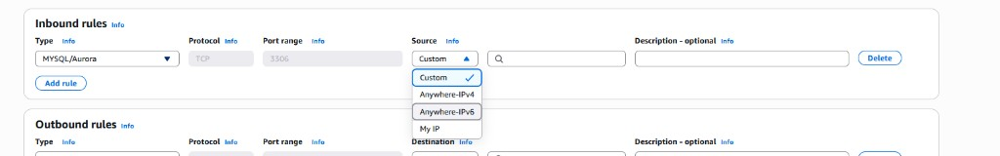

Use the same **Custom → search by name** pattern for **`my-project-backend-server-sg`**: **Custom TCP**, port **5000**, source **`my-project-web-server-sg`**.

**If you see:** *“You may not specify a referenced group id for an existing IPv4 CIDR rule”* — the rule row still has an **IP/CIDR** source (for example **Anywhere** `0.0.0.0/0` or a leftover CIDR chip). AWS does not let you turn that same row into a **security group** source; you must start clean.

1. Click **Delete** on that inbound rule (or remove every source chip in the **Source** field).
2. **Add rule** again: **MySQL/Aurora** (or **Custom TCP** / **5000** for the backend group).
3. **Source:** **Custom** only — do not pick **Anywhere-IPv4** first.
4. In the search box, type the **name** (`my-project-backend-server-sg` for the database group). Under **Security groups**, click the line that shows **name | sg-…** — do not rely on **Use:** with a pasted ID if the row still had CIDR before.

Pick the **correct** group for each row: database → **`my-project-backend-server-sg`** (not the web server). If the dropdown only shows `my-project-web-server-sg`, create **`my-project-backend-server-sg`** first or search for `backend` in the same VPC.

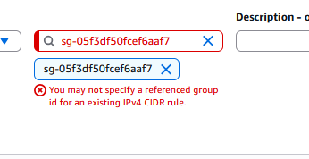

**Why this order:** The database accepts MySQL only from the backend; the backend accepts API traffic only from the frontend security group.

**Beginner mistake:** Opening MySQL (3306) or SSH to the entire internet on production systems. This lab uses open SSH on the frontend only for learning.

---

## Phase 3 — IAM for EC2 (SSM access)

Both EC2 instances use **Systems Manager (SSM)** so you can open a shell on the private backend without SSH from the internet.

1. Open **IAM** → **Roles** → **Create role**.
2. **Trusted entity:** **AWS service** → **EC2** → Next.
3. **Permissions:** attach **`AmazonSSMManagedInstanceCore`** (AWS managed policy) → Next.
4. **Role name:** `my-project-ec2-ssm-role` → **Create role**.

**Instance profile (console often creates this with the role):**

- In **IAM** → **Roles** → `my-project-ec2-ssm-role`, confirm an **instance profile** exists with the same name. EC2 launch wizard will list it as **`my-project-ec2-ssm-role`**.

---

## Phase 4 — EC2 key pair

1. **EC2** → **Key Pairs** → **Create key pair**.
2. **Name:** `my-project-deployer-key`
3. **Type:** RSA, **.pem** for OpenSSH
4. **Create** — download the `.pem` file and store it safely (never commit to Git).

You will use this key to SSH to the **frontend** (public) instance if needed.

---

## Phase 5 — RDS MySQL

### DB subnet group

1. **RDS** → **Subnet groups** → **Create DB subnet group**.
2. **Name:** `my-project-database-subnet-group`
3. **Description (required):** the console blocks **Create** if this is empty — use for example `Private subnets for my-project RDS MySQL` (any short label is fine; you cannot leave it blank).
4. **VPC:** `my-project-vpc`
5. **Subnets:** add **`my-project-private-subnet-a`** and **`my-project-private-subnet-b`** (two AZs).
6. **Create**.

### Database instance

1. **RDS** → **Databases** → open the **Create database** dropdown (orange button).
2. Choose **Full configuration** — not **Express configuration** or **Restore from S3**.
   - **Express** hides most networking choices and is a poor fit when you must pick **`my-project-vpc`**, your **DB subnet group**, **no public access**, and **`my-project-database-sg`**.
   - **Restore from S3** is for importing a backup file, not creating a new empty database for this lab.

   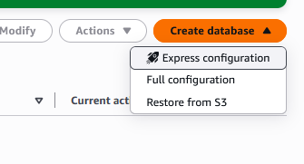

3. **Engine options:** **MySQL** (pick **MySQL 8.0** on the version step if the console asks separately).
4. **Choose a database creation method:** **Full configuration** — not **Easy create**.
   - **Full configuration** — you set VPC, subnet group, security groups, backups, and maintenance (required for this lab).
   - **Easy create** — AWS picks many defaults; it is the same idea as **Express configuration** on the **Create database** menu. Skip it here so you can wire RDS into **`my-project-vpc`** and **`my-project-database-sg`**.
5. **Templates:** **Free tier** if your account still has it; otherwise **Dev/Test** is fine for learning. Avoid **Production** (higher cost and stricter defaults you do not need for a first pass).

   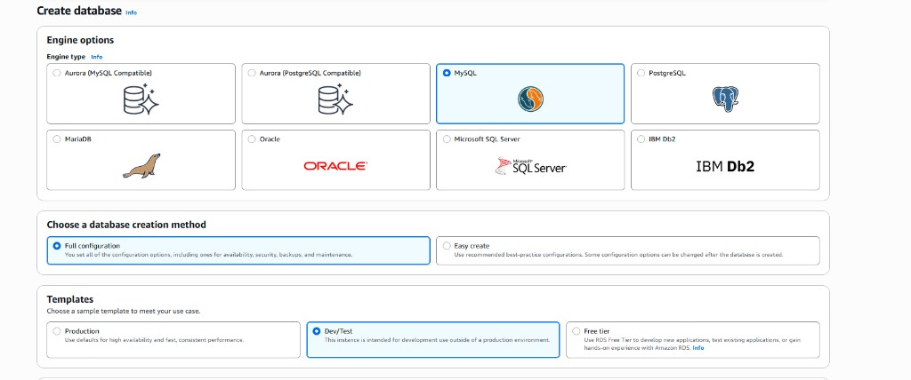

6. **Availability and durability** → **Deployment options:** choose **Single-AZ DB instance deployment (1 instance)**.
    - **Single-AZ** — one database in one Availability Zone. Lowest cost; fine for this learning stack and matches Free tier / Dev/Test.
    - **Multi-AZ DB instance deployment (2 instances)** — primary plus a standby in another AZ for automatic failover. Use in real production; roughly doubles RDS cost and is unnecessary for Part 1.
    - **Multi-AZ DB cluster deployment (3 instances)** — primary plus two readable standbys. For high-scale production reads; skip for this lab.

    Your **DB subnet group** still lists subnets in **two AZs** (RDS requirement). **Single-AZ** only means AWS runs **one** live DB instance, not that you delete a private subnet.

    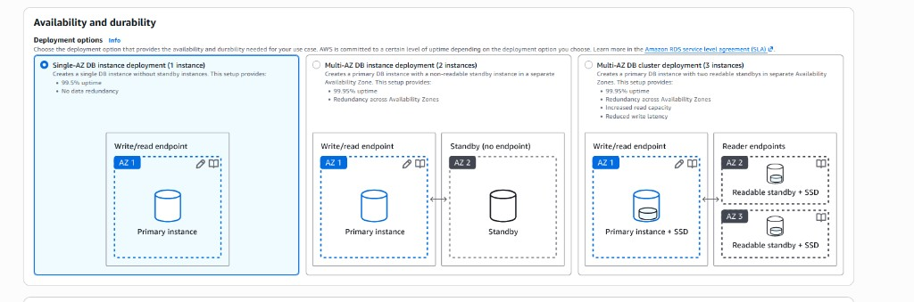

7. **DB instance identifier:** `my-project-mysql`
8. **Credentials management** (Settings → master user):
    - **Master username:** `dbadmin` (1–16 characters; first character must be a letter).
    - **Credentials management:** **Self managed** — not **Managed in AWS Secrets Manager**. The backend bootstrap script expects a password you choose and paste into `backend-setup.sh` as `${db_password}`; Secrets Manager adds cost and a different retrieval flow you do not need for Part 1.
    - **Master password:** enter a strong password and save it in your notes file (same value as the **DB password** row in [Before you start](#before-you-start--pick-consistent-names) and in troubleshooting if connection fails later). You can use **Auto generate a password** under self managed only if you copy the generated value immediately — manual entry is simpler for this walkthrough.
    - Expand **Additional credentials settings** → **Database authentication options:** leave **Password authentication** selected (not IAM or Kerberos).

    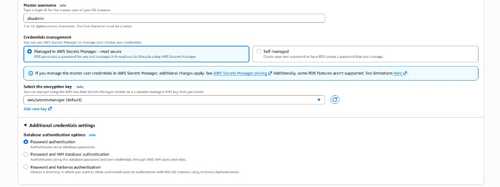

9. **Instance configuration** → **DB instance class:** select **`db.t3.micro`** (Free tier / smallest burstable size).
    - **Micro** lives under **Burstable classes (includes t classes)** — not under **Standard classes (includes m classes)**. If **Standard** is selected, searching `mic` only matches **m** sizes (for example `db.m7g.large`), not **t3.micro**.
    - Select **Burstable classes**, then search **`t3.micro`** or scroll to **`db.t3.micro`**. If it is missing, your region or engine version may offer **`db.t4g.micro`** instead (ARM; still fine for this lab).
    - Leave **Show instance classes that support Amazon RDS Optimized Writes** and **Include previous generation classes** off unless you know you need them.

    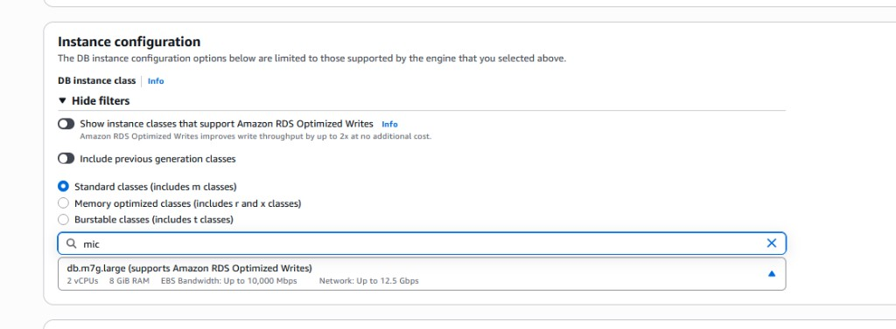

10. **Storage:**
    - **Storage type:** **General Purpose SSD (gp3)** — default on new RDS databases and the right choice for this lab. Performance (IOPS and throughput) can be tuned separately from disk size. Do not pick **Provisioned IOPS (io1/io2)** unless you have a high-I/O production workload; they cost more.
    - **General Purpose SSD (gp2)** is older; use **gp3** when the console offers both.
    - **Allocated storage:** **20 GiB** (minimum for gp3 on many engines). That is enough for the Todo app and keeps cost low.
    - At **20 GiB**, **Provisioned IOPS** and **Storage throughput** stay at the included baselines (**3,000 IOPS** and **125 MiBps**) and are often greyed out. You only need to raise storage to **400 GiB+** if you want to customize IOPS/throughput — not for Part 1.
    - Leave **Additional storage configuration** collapsed unless you need storage autoscaling (optional; off is fine for the lab).

    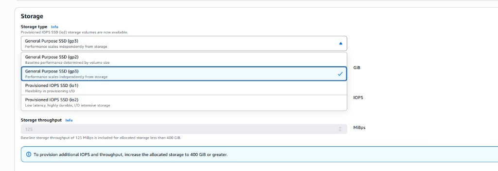

    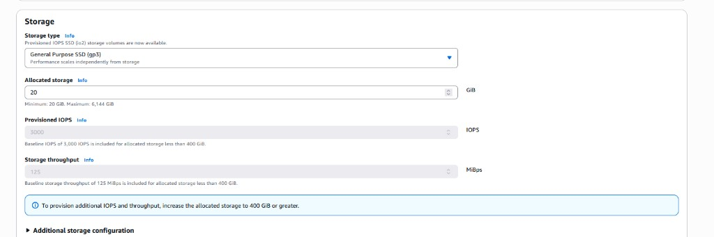

11. **Connectivity:**
    - **Compute resource:** **Don’t connect to an EC2 compute resource** — you already defined security groups in Phase 2; the backend will reach RDS over the private network using **`my-project-database-sg`** rules, not the console’s “connect to EC2” shortcut.
    - **Virtual private cloud (VPC):** **`my-project-vpc`**. After the database is created you **cannot change its VPC**, so confirm the correct VPC before continuing.
    - **DB subnet group:** **`my-project-database-subnet-group`** (your two private subnets across two AZs).
    - **Public access:** **No** — no public IP on RDS; only resources inside the VPC (your backend EC2) can connect on port **3306**.

    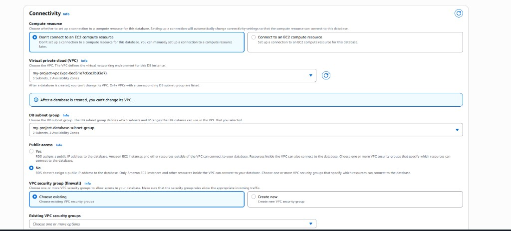

    - **VPC security group (firewall):** **Choose existing** (do not **Create new** here).
    - **Existing VPC security groups:** select **`my-project-database-sg`** only. The console often pre-selects the VPC **`default`** security group — click the **×** on **`default`** so it is removed. Keeping **`default`** widens exposure and does not match this lab’s tiered firewall design.
    - **Availability Zone:** **No preference** (RDS picks an AZ that uses your subnet group; Single-AZ still runs one instance).
    - **RDS Proxy:** leave **Create an RDS Proxy** **unchecked** (extra cost and Secrets Manager wiring; not needed for Part 1).
    - **Certificate authority (optional):** leave the default (**`rds-ca-rsa2048-g1`** or whatever the console offers). TLS to RDS is optional for this learning stack; the app uses a normal MySQL password on the private network.

    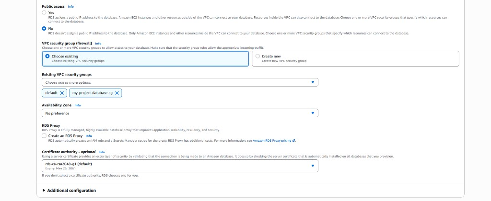

12. **Monitoring:**
    - **Database Insights:** leave **Database Insights - Standard** selected. It includes seven days of detailed database metrics at no extra charge. **Database Insights - Advanced** adds fleet-level views, Application Signals integration, and longer retention — useful in production, but not required for Part 1 (and billed separately from the RDS estimate).
    - Expand **Additional monitoring configuration** if it is collapsed:
      - **Enhanced monitoring:** you can **enable** it to see OS-level CPU and memory per process in CloudWatch (granularity **60 seconds** is fine). That adds a small hourly charge. For the lab, **leaving it disabled** is acceptable — basic RDS CloudWatch metrics still show instance health.
      - If you enable Enhanced monitoring, under **Monitoring role for OS metrics** choose **Create default role** so AWS creates **`rds-monitoring-role`** (RDS can publish OS metrics to CloudWatch Logs).
    - **Log exports:** leave all checkboxes **unchecked** (**Audit**, **Error**, **General**, **iam-db-auth-error**, **Slow query**) unless you want logs in CloudWatch for debugging. Each export type can add log storage cost; none are required for the Todo app to run.
    - **IAM role** for log exports: when logs are off, the console shows the **RDS service-linked role** — no action needed.

    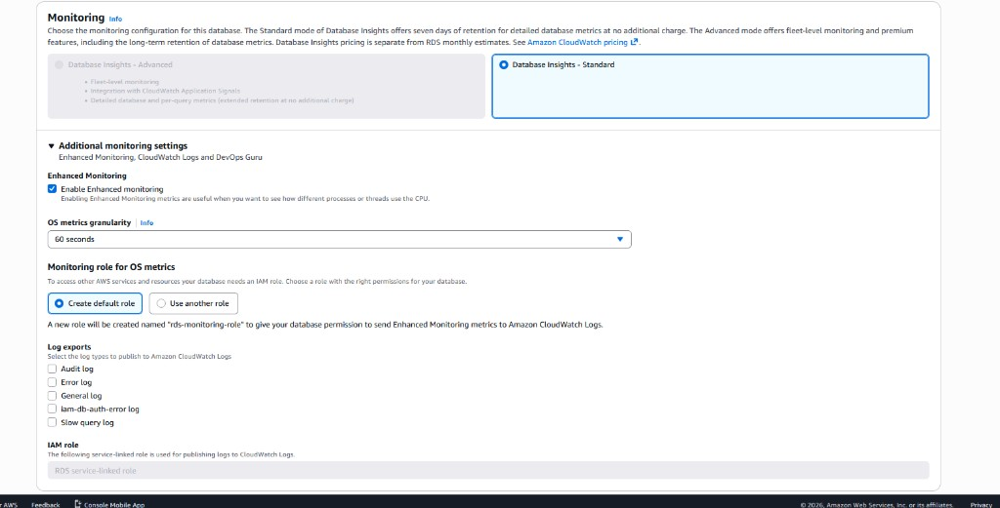

13. **Additional configuration** (expand the section if the console collapsed it):
    - **Database options**
      - **Initial database name:** `todo_app` — matches what `backend-setup.sh` expects as `${db_name}`. If you leave this blank, RDS creates only the instance; you would have to create the schema manually later.
      - **DB parameter group:** leave the default for your engine (for example **`default.mysql8.0`** or **`default.mysql8.4`**). Parameter groups tune MySQL settings; defaults are fine for Part 1.
      - **Option group:** leave the default (for example **`default:mysql-8-0`** or **`default:mysql-8-4`**). Option groups enable optional features such as MariaDB audit plugins — not needed here.
    - **Encryption**
      - **Enable encryption:** leave **checked** (recommended). Data at rest is encrypted with the account’s **`(default) aws/rds`** KMS key. You do not need to create a custom KMS key for this lab.
    - **Backup** (scroll within **Additional configuration** if needed)
      - For a throwaway lab you can **uncheck Enable automated backup** to avoid snapshot storage charges. If you keep backups on, set **Backup retention period** to **1 day** (minimum) instead of **7 days**.
      - **Backup window:** **No preference** is fine.
      - Leave **Copy tags to automated backup** off unless you use tags for cost allocation. **Copy tags to snapshots** on or off does not matter much for a single lab DB.
      - **Enable replication in another AWS Region:** leave **unchecked** (disaster recovery pattern; extra cost).
    - **Maintenance**
      - **Enable auto minor version upgrade:** either checked or unchecked is acceptable for Part 1; unchecked avoids surprise maintenance during the lab.
      - **Maintenance window:** **No preference**.
      - **Enable deletion protection:** leave **unchecked** so you can delete the instance when you tear down the stack.

    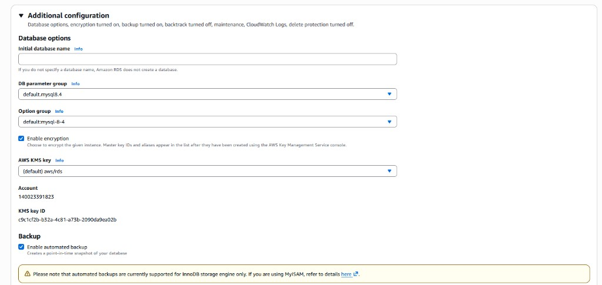

    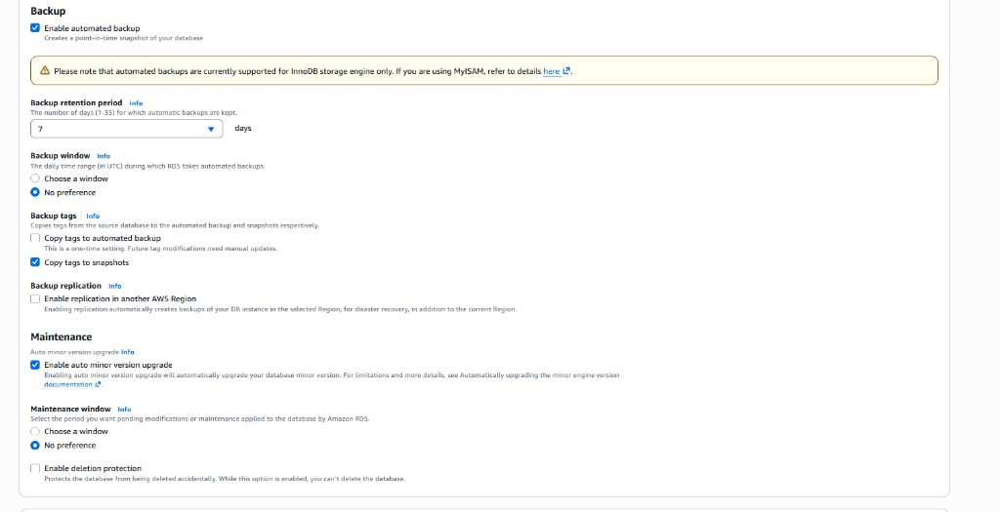

14. **Create database**

Wait until status is **Available** (often 10–15 minutes). Copy the **Endpoint** hostname (e.g. `my-project-mysql.xxxx.us-east-1.rds.amazonaws.com`).

---

## Phase 6 — Backend EC2 (private)

### Prepare user data

Bootstrap is the same script the Terraform project uses. On your laptop:

1. Open [backend-setup.sh](https://github.com/mahisat/aws-basic-3-tier-architecture/blob/main/terraform/backend-setup.sh) from the companion repo.
2. Copy the full script.
3. Replace Terraform placeholders with **your** values (plain text, no `${}` left). See [Keep every copy of a value the same](#keep-every-copy-of-a-value-the-same) — `${db_endpoint}`, `${db_password}`, and related fields must match RDS everywhere they appear in the script.

| Placeholder | Replace with |
|-------------|----------------|
| `${github_repo}` | `https://github.com/mahisat/aws-basic-3-tier-architecture` |
| `${db_endpoint}` | RDS endpoint hostname |
| `${db_user}` | `dbadmin` |
| `${db_password}` | your DB password |
| `${db_name}` | `todo_app` |
| `${systemd_unit}` | See below |

For **`${systemd_unit}`**, keep the `cat > /etc/systemd/system/todo-backend.service << 'UNITEOF'` block at the end of the script, but **delete the line** `${systemd_unit}` and paste the full contents of [todo-backend.service](https://github.com/mahisat/aws-basic-3-tier-architecture/blob/main/terraform/todo-backend.service) between `UNITEOF` markers (same as Terraform’s `templatefile` output). [Part 2](/posts/part-2-terraform-aws-three-tier/#ec2tf--wiring-user_data) shows how Terraform wires this automatically.

### Launch the instance

1. **EC2** → **Instances** → **Launch instances**.
2. **Name:** `my-project-backend-server`
3. **AMI:** **Amazon Linux 2023**
4. **Instance type:** `t3.micro`
5. **Key pair:** `my-project-deployer-key`
6. **Network:**
   - **VPC:** `my-project-vpc`
   - **Subnet:** `my-project-private-subnet-a`
   - **Auto-assign public IP:** **Disable**
7. **Security groups:** select **`my-project-backend-server-sg`** only
8. **Advanced details:**
   - **IAM instance profile:** `my-project-ec2-ssm-role`
   - **User data:** paste your edited **backend-setup.sh** script
9. **Launch instance**

After the instance is **Running**, note its **Private IPv4 address** (e.g. `10.0.2.50`). The frontend needs this for nginx.

**Verify bootstrap (after ~5–15 minutes):**

- **EC2** → instance → **Connect** → **Session Manager** (uses SSM).
- Run: `sudo tail -50 /var/log/cloud-init-output.log` and `sudo systemctl status todo-backend`

See [Linux commands reference](/reference/linux-commands-reference/).

---

## Phase 7 — Frontend EC2 (public)

### Prepare user data

1. Open [frontend-setup.sh](https://github.com/mahisat/aws-basic-3-tier-architecture/blob/main/terraform/frontend-setup.sh) and [nginx-frontend.conf.tpl](https://github.com/mahisat/aws-basic-3-tier-architecture/blob/main/terraform/nginx-frontend.conf.tpl).
2. In the nginx template, replace `${backend_host}` with the **backend private IP** from Phase 6 (EC2 → backend → **Private IPv4**).
3. In the frontend script, set:
   - `${github_repo}` → your public repo URL
   - `${vite_api_base_url}` → `/api` (nginx proxies `/api` to the backend)
   - `${nginx_conf}` → the full nginx config block (with backend IP filled in)

4. **Double-check:** the same backend IP must appear in **both** step 2 and the nginx block in step 3. Search the full `frontend-setup.sh` for that IP and for any stale address you used in an earlier attempt.

### Launch the instance

1. **Launch instances** → **Name:** `my-project-web-server`
2. **AMI / type / key:** same as backend
3. **Subnet:** `my-project-public-subnet` — **Auto-assign public IP:** **Enable**
4. **Security groups:** **`my-project-web-server-sg`** and **`my-project-ssh-sg`**
5. **IAM instance profile:** `my-project-ec2-ssm-role`
6. **User data:** edited **frontend-setup.sh**
7. **Launch**

Copy the instance **Public IPv4 address**.

---

## Phase 8 — Test the application

1. Wait for cloud-init to finish on both instances (frontend often 5–10 minutes after backend is healthy).
2. In a browser: `http://<frontend-public-ip>/`
3. Add a todo item — data should persist in RDS.

**Quick API checks from the frontend instance (Session Manager or SSH):**

```bash
curl -s http://<backend-private-ip>:5000/health
curl -s http://localhost/api/health
```

If `/api` returns **504** or hangs, check nginx `proxy_pass` uses the **current** backend private IP (wrong IP often shows **504 Gateway Timeout**). If you get **502** with the correct IP, see SELinux in [Part 3 troubleshooting](/posts/part-3-github-actions-oidc/) (`httpd_can_network_connect` — the frontend setup script enables this when possible).

---

## Troubleshooting (Console Part 1)

| Symptom | Likely cause | What to do |
|---------|--------------|------------|
| No app on frontend | user_data still running or failed | `sudo tail -100 /var/log/cloud-init-output.log` on each instance |
| Backend can’t clone GitHub | NAT or routing wrong | From backend via SSM: `curl -I https://github.com` |
| `Connection refused` on :5000 | API not built or not started | `sudo journalctl -u todo-backend -n 50` |
| RDS connection errors | Wrong endpoint/password in `.env` | Fix `.env` on backend and restart service |
| Browser can’t load page | Wrong SG or no public IP on frontend | Check port 80 on `my-project-web-server-sg` |
| `/api` or `/health` **504** (or **502**); curl to **correct** backend IP works from frontend | Stale or wrong backend IP in nginx (common after recreating backend) | `grep proxy_pass /etc/nginx/conf.d/*.conf`; fix IP, `sudo nginx -t && sudo systemctl reload nginx` |
| Changed user data but app unchanged | user_data not re-run on stop/start | Fix files on instance or `cloud-init clean` + reboot; see [Keep every copy of a value the same](#keep-every-copy-of-a-value-the-same) |
| RDS won’t create | Subnet group spans only one AZ | Add second private subnet in another AZ |
| Can’t delete subnet or route table | **DB subnet group** still exists | Delete RDS, then delete **`my-project-database-subnet-group`**, then subnets → route tables ([Tear down](#tear-down-manual)) |
| Red border on Source; CIDR vs SG error | Rule started as **Anywhere**/CIDR, then SG added on same row | Delete rule; add new rule with **Custom** and pick SG from **Security groups** list |

---

## Cost considerations

| Resource | Billing note |
|----------|----------------|
| NAT Gateway | Hourly + data; largest fixed cost in this lab |
| RDS | Instance hours + storage |
| EC2 `t3.micro` | Often Free Tier eligible |
| Elastic IP | Charged while allocated (including after NAT is gone if you forget to release it) |

**Tip:** Delete resources when you finish learning (see below). **Elastic IPs cost money** — always **release** them during tear down, not only delete the NAT Gateway.

---

## Tear down (manual)

Delete in roughly this order to avoid dependency errors:

1. Terminate **EC2** instances (frontend, then backend)
2. **RDS** → delete `my-project-mysql` (skip final snapshot for lab)
3. Delete **NAT Gateway** (`my-project-nat-gateway`) and wait until it is gone from the list.
4. **Release the Elastic IP** used by that NAT:
   - **EC2** → **Elastic IPs** (under **Network & Security**).
   - After the NAT is deleted, the address may still show as allocated to the old NAT association for **about 3–5 minutes**. If **Release** is greyed out, wait and refresh the page.
   - When release is allowed, select the address → **Actions** → **Release Elastic IP addresses** → confirm.
   - **Elastic IPs cost money while they remain allocated**, even with no NAT or EC2 attached. Skipping release is a common post-lab billing surprise.
5. Detach and delete **Internet Gateway**
6. Delete the **DB subnet group** (**RDS** → **Subnet groups** → `my-project-database-subnet-group` → **Delete**). Do this **after** the RDS instance is fully deleted (step 2). The subnet group still references your private subnets; until it is gone, the console often **blocks deleting subnets or custom route tables** (dependency error).
7. Delete **subnets** (`my-project-public-subnet`, `my-project-private-subnet-a`, `my-project-private-subnet-b`).
8. Delete **custom route tables** only (`my-project-public-route-table`, `my-project-private-route-table`). Do **not** try to delete the VPC **main** route table — it is removed when you delete the VPC. If step 8 fails, confirm step 6 completed and no subnet is still associated with that route table (**Route tables** → **Subnet associations** → disassociate first).
9. Delete **security groups** in dependency order (see [Phase 2](#phase-2--security-groups-firewalls)): **`my-project-database-sg`** → **`my-project-backend-server-sg`** → **`my-project-web-server-sg`** and **`my-project-ssh-sg`**
10. Delete **VPC** (`my-project-vpc`)
11. Delete **IAM role** (and instance profile) and **key pair** (`my-project-deployer-key`) if you no longer need them

---

## What you learned in Part 1

- How **VPC, subnets, IGW, and NAT** fit together in the console.
- How **security groups** isolate tiers.
- How **RDS** lives only in private subnets across two AZs.
- How **user data** bootstraps the same Todo app the Terraform track deploys.
- Where to look when **cloud-init** or **systemd** fails.

**Next:** [Part 2 — Build the same architecture with Terraform](/posts/part-2-terraform-aws-three-tier/) so infrastructure becomes repeatable, reviewable code. After that, [Part 3 — GitHub Actions & OIDC](/posts/part-3-github-actions-oidc/) automates deployments.

**Companion repo (application + scripts):** [github.com/mahisat/aws-basic-3-tier-architecture](https://github.com/mahisat/aws-basic-3-tier-architecture)

**Further reading:** [Linux commands reference](/reference/linux-commands-reference/)

---
